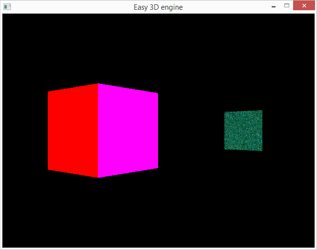

**IMPORTANT:** This project is currently a *work-in-progress*, and certain files will not be of final quality in terms of content and structure. Please keep this in mind when examining the source code.

---

# Introduction
An easy-to-understand 3D game engine, for *learning and experimenting*. Forking and hacking the code for your own project is also encouraged :)

**Note:** The engine is currently only buildable on Windows systems.

# Getting Started

1. Install [Visual Studio Community Edition](https://visualstudio.microsoft.com)
    - Remember to toggle the `Desktop development with C++` feature.
2. Install the SDL runtime:
    - Open the [SDL download page](https://www.libsdl.org/download-2.0.php).
    - Under `Runtime Binaries : Windows`, click the `32-bit Windows` link.
    - Extract the `SDL2.DLL` file to `C:\Windows`.
3. Install the SDL SDK:
    - From the same page as above, under `Development Libraries : Windows`, click the `Visual C++ 32/64-bit` link.
    - Extract the file to `C:\SDK`.
4. Install GLEW:
    - Open the [GLEW download page](http://glew.sourceforge.net/).
    - Click the `Windows 32-bit and 64-bit` link.
    - Extract the file to `C:\SDK`
5. Ensure you have downloaded or cloned this repository, by clicking the green button above.
6. Open the project in Visual Studio by loading the `easy-3d-engine.sln` file from your local repository folder.
6. Start the engine by clicking on the `Debug` menu in Visual Studio, then `Start Without Debugging`.
7. Move around in the engine with the arrow keys, and press `ESC` to quit.

# Technical notes
* For simplicity we standardise on 32-bit for the build, and third-party libraries.
* As a starting point, we use the (now deprecated) Fixed Function Pipeline approach for OpenGL. We will move to the modern shader-driven approach as time permits.
